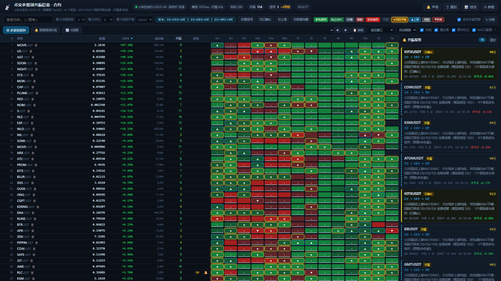
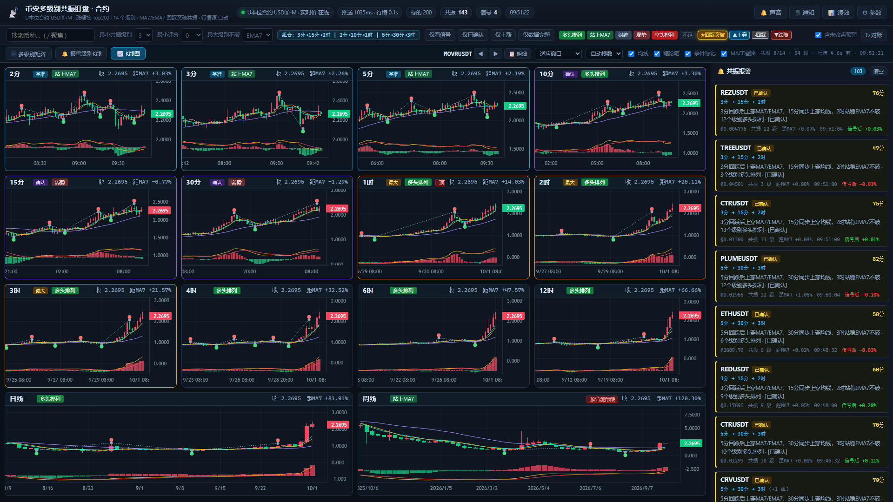
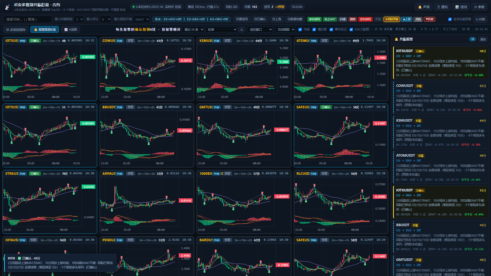
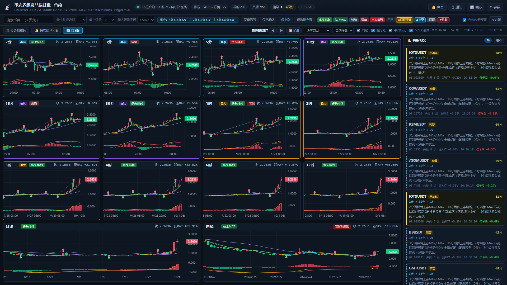

# 币安多级别共振盯盘系统

按 **24h 涨幅榜前 200 个标的** × **14 个显示级别**实时盯盘，按「**固定级别组合** + 回踩突破 MA7/EMA7」规则自动报警。

**默认跑 U 本位永续合约（USDⓈ-M）**，一条命令即可切回现货。

* 数据源：币安**公开**接口，**无需 API Key**，纯只读行情、不下单。
* 依赖：**零第三方依赖**，只用 Node.js 内置能力（`fetch` / 全局 `WebSocket` / `node:http`）。
* 延迟：合约走 `!bookTicker` 实时价驱动，K线在边界处 **1~2 秒**内判定收盘；现货走 K线 WebSocket。

> **两种用法**：
> · **本机完整版**（推荐，功能最全）—— 按下面的命令跑 Node 后端，带钉钉推送与绩效持久化
> · **纯前端在线版** —— 无需后端，浏览器直连币安公开接口，见「第二章 纯前端在线版」
>
> 在线版能用的是：多级别矩阵 / 多级别K线 / 报警级别K线 / 全部信号逻辑。
> 不能用的是：钉钉推送、服务端持久化。

## 界面

**▦ 多级别矩阵** —— 200 标的 × 14 级别的多空色块矩阵，一眼扫全局



**📈 K线图** —— 当前币种的 14 个级别按周期升序依次铺开（2分 → 周线），
含 MA7 / EMA7 / MA25、MACD 副图、缠论笔折线、顶底分型标记；「适应窗口」一屏铺满不出滚动条



**🔔 报警级别K线** —— 每条报警取它**自己组合里的确认级别**（`3m>15m>2h` 画 15分、`5m>30m>3h` 画 30分），
严格按提醒顺序排列



**📋 级别明细** —— 单币种 14 个级别的均线数值、状态、事件



## 一、快速开始

```bat
cd K:\币\binance-monitor
node server.js                       :: 默认 = U本位合约
set MARKET=spot && node server.js    :: 切回现货
```

浏览器打开 **http://127.0.0.1:8848**

> 首次启动会用约 1~2 分钟在权重预算内渐进「播种」200 个标的 × 12 个原生周期的历史 K 线。
> 播种期间面板已可用，进度显示在「推送/行情」状态胶囊的悬停提示里。

双击 `启动.bat` 亦可（会自动打开浏览器）。改端口：`set PORT=9000 && node server.js`

---


## 二、纯前端在线版（浏览器直连币安，无需后端）

整个盯盘系统可以在**没有后端**的情况下跑起来 —— 数据由浏览器直接向币安公开接口获取。

### 为什么能这么做

后端里真正与运行环境相关的只有三处，改完之后 **11 个核心模块两端共用同一份源文件**：

| 原实现 | 改成 | 理由 |
|---|---|---|
| `config.js` 用 `process.env` | `typeof process !== 'undefined'` 守卫 | 浏览器没有 `process` |
| `engine.js` 继承 `node:events` 的 EventEmitter | 换成自带的 40 行 `src/emitter.js` | 只用了 on/emit 两个方法 |
| `tracker.js` 内联 `node:fs` | 存储改为**注入适配器**（Node 用 `fileStorage()`，浏览器用 localStorage） | 同一份绩效逻辑两端复用 |

于是 `src/` 下的 config / indicators / chan / series / signals / rest / market / tickfeed / engine /
emitter / logger / tracker / push-meta **浏览器都能直接 import**，零复制、零漂移。

真正新写的只有 `src/browser/boot.js`：把 `window.fetch` 里所有 `/api/*` 请求**就地路由**到内存中的
engine/market，并用本地 SSE 替身驱动 `/api/stream`。因此 **`public/app.js` 与 `public/chart.js` 一行都不用改**。

### 构建与预览

```bat
node tools/build-web.mjs      :: 产出可部署的 web/ 目录（约 365 KB）
node tools/serve-web.mjs      :: 本地预览 http://127.0.0.1:8850/
node tools/verify-web.mjs     :: 真实 Chrome 端到端验证（29 项）
```

构建时会**硬检查**：所有要下发给浏览器的模块不得 import 任何 `node:` 内置模块，否则直接构建失败
（否则网页会静默挂掉，非常难查）。

### 实测结果

| 项目 | 结果 |
|---|---|
| 标的数 | 200（涨幅榜，浏览器直接拉） |
| 行情源 | tick-rest（实时价 + REST 补K线） |
| bookTicker | **4338 条 / 55 秒，0 重连** |
| 价格 tick | 1197 次，驱动K线实时更新 |
| 活跃标的变价 | 成交额前 40 名中 **18 个在 6 秒内变价** |
| 端到端验证 | **29 / 29 通过**，无 JS 异常 |

### ⚠️ 在线版的两个硬限制

**1. 币安的 K线 WebSocket 在本网络下被屏蔽** —— 实测（Node 与浏览器结果一致）：
`!bookTicker` 正常（886 帧/9 秒），而 `kline_*` / `markPrice` 只回订阅回执、**零数据帧**，
combined 流 14 帧后直接 `close 1008`。所以在线版与后端版用的是**同一套应对方案**：
实时价驱动K线 + REST 滚动修正。

**2. 钉钉推送不可用** —— 需要后端保管密钥，且浏览器无法跨域调用钉钉 Webhook。
前端面板仍会渲染（读到的是同一份 `push-meta.js`），但测试消息会明确提示不支持。

> ⚠️ 还有一点必须说清楚：**纯前端应用的代码天然是公开的** —— 浏览器要下载它才能运行。
> 所以「把仓库设为私有」并不能隐藏逻辑；要真正保密只能保留后端架构。

---

## 三、合约 vs 现货：两套完全独立的接口

| | U 本位合约（默认） | 现货 |
|---|---|---|
| REST | `fapi.binance.com/fapi/v1/*` | `api.binance.com/api/v3/*` |
| WS | `fstream.binance.com/ws` | `stream.binance.com:9443/ws` |
| **IP 权重额度** | **2400/分钟** | 6000/分钟 |
| 标的范围 | 527 个 USDT 永续 | 496 个 USDT 现货对 |
| 涨幅榜 | `/fapi/v1/ticker/24hr`（权重 40） | `/api/v3/ticker/24hr`（权重 80） |
| 行情源 | `!bookTicker` + REST 补K线 | K线 WebSocket |

切换只需 `MARKET=spot` / `MARKET=futures`，代码里由 `MARKET_PROFILES` 统一驱动。
**注意合约的 IP 额度只有现货的 40%**，所以 K线拉取根数、刷新节奏、限频预算都按合约重新排过。

---

## 四、⚠ 合约行情流的关键坑（实测，务必知道）

从**部分网络环境**访问时，币安 U 本位合约的 WebSocket 会**按流类型静默拦截**：
连接正常、`SUBSCRIBE` 回执正常、`LIST_SUBSCRIPTIONS` 也确认订阅成功，
**但特定类型的数据一个字节都不推送**。

用**手工 TLS + WebSocket 握手**（完全绕开 WS 库）实测的结论：

| 流类型 | fstream（U 本位） | stream（现货） | dstream（币本位） |
|---|---|---|---|
| `kline_*` | ❌ **零数据** | ✅ 正常 | ✅ 正常 |
| `aggTrade` | ❌ 零数据 | ✅ | ✅ |
| `markPrice` | ❌ 零数据 | — | ✅ |
| `miniTicker` / `ticker` | ❌ 零数据 | ✅ | ✅ |
| **`bookTicker`** | ✅ **正常** | ✅ | ✅ |
| `depth` / `depth5@100ms` | ✅ 正常 | ✅ | ✅ |

所以**不是代码问题、不是库问题、不是流名写错**，而是这条网络路径上的选择性封锁。
（`fstream-auth`、`:443`、`:9443`、combined `/stream?streams=` 全都试过，一样。）

### 系统怎么绕过去

既然 `bookTicker` 可用，合约版改成 **tick-rest 混合行情源**：

```
① !bookTicker（全市场最优买卖价，一条订阅覆盖 737 个标的，约 110 条/秒、18 KB/s）
      ↓  中间价 = (买一 + 卖一) / 2
② 用实时价驱动每根"正在形成"的K线（CandleSeries.applyTick）
      ↓  K线跨过时间边界时立即定稿，并立刻重估该标的的信号
③ REST /fapi/v1/klines 按周期滚动补真实 OHLCV（价格流拿不到真实最高/最低与成交量）
```

实测效果（`node tools/status.mjs`）：

```
bookTicker: open   消息 20600   价格tick 5646   重连 0
滚动补K线 : 累计 1963 次
实时性：5 秒内 2分/3分/5分/15分 K线价格全部已变动
权重    : 1460/2400
```

启动时 `FEED=auto` 会**先尝试 K线 WebSocket，15 秒内收不到数据就自动降级**到 tick-rest；
如果你的网络（比如挂了 VPN）能收合约 K线流，它会自动用回零权重的纯 WS 模式。

| 环境变量 | 取值 | 说明 |
|---|---|---|
| `MARKET` | `futures`（默认） / `spot` | 市场 |
| `FEED` | `auto`（默认） / `kline-ws` / `tick-rest` | 行情源 |
| `PORT` | 默认 `8848` | 端口 |

---

## 五、级别组合（核心）

报警不是"相邻级别自动配对"，而是**你指定的固定三元组**：

```
基准级别  →  确认级别  →  最大级别
3 分钟    →  15 分钟   →  2 小时
2 分钟    →  10 分钟   →  1 小时
5 分钟    →  30 分钟   →  3 小时
```

**三者不必相邻** —— 3分 → 15分 中间隔着 5分/10分，这是允许且默认的。
在 ⚙ 参数面板里可以任意增删组合、单独启停某组、随时改级别，改完立即重扫。

想改成"自动穷举"（基准 + 它的下一档 + 任意更大级别）也行，勾上开关即可，但信号量会大很多。

### 14 个显示级别是怎么来的

币安**没有原生的 `2分钟` / `10分钟` / `3小时`**（`interval=2m`、`3h` 都直接返回 400），
这三个周期由本地合成，其余全部走币安原生周期：

| 级别 | 2m | 3m | 5m | 10m | 15m | 30m | 1h | 2h | 3h | 4h | 6h | 12h | 1d | 1w |
|---|---|---|---|---|---|---|---|---|---|---|---|---|---|---|
| 来源 | **1m合成(2:1)** | 原生 | 原生 | **5m合成(2:1)** | 原生 | 原生 | 原生 | 原生 | **1h合成(3:1)** | 原生 | 原生 | 原生 | 原生 | 原生 |

> `1分钟` 本身只作为合成 2 分钟的数据源，**不显示在矩阵里、也不计入"多头排列"的级别数**。

合成正确性已被验证：把 `1m` 合成成 `3m`，与币安**原生 3m** 逐根逐字段比对（见 7.1），332 根全部一致。

---

## 六、报警逻辑（严格对应需求）

> 需求原文拆解：
> ① 需要 **3 个级别以上为多头排列**；
> ② 基准级别**先回踩，后突破 MA7 / EMA7 均线上方**；
> ③ **确认级别也要同步上穿**均线；
> ④ 组合中的**最大级别不能跌破均线**；
> ⑤ 级别组合是**固定指定的**（如 3分-15分-2时、2分-10分-1时、5分-30分-3时）。

对**每一组配置的三元组**，必须**同时**满足：

| 条件 | 判定方式 |
|---|---|
| **① 多头排列 ≥ 3 级** | 统计全部显示级别中 `close > MA7 > MA25` 且 MA7 上行 的个数，需 ≥ `minBullLevels`（默认 3） |
| **② 基准回踩** | 最近 `pullbackLookback`(默认6) 根K线内，某根的**最低价触及 MA7**（容差 0.2%），且该根**收盘未有效跌破**（允许 -0.6%），且回踩**之前**价格站在 MA7 上方 |
| **② 基准突破** | 最近 `triggerLookback`(默认2) 根内发生**收盘上穿 MA7**，且当前同时站上 **EMA7**；上穿必须发生在回踩之后 |
| **③ 确认级别上穿** | 组合里指定的确认级别，最近 `adjacentLookback`(默认3) 根内**收盘上穿 MA7**，且自身处于多头形态 |
| **④ 最大不破** | 组合里指定的最大级别 `close ≥ EMA7`（可切 MA7）**且** `close ≥ MA25` **且** 非空头排列 |

任一组合命中即产生信号，按 0~100 打分；同一币种取**最强的一组**推送到报警面板。

**信号分两类：**

* ✅ **已确认** —— 只用**已收盘**K线判定，不会重绘，K线一收盘即触发；
* ⚡ **预警** —— 含**正在形成中**的K线，用于抢跑，可能在收盘前消失（卡片虚线边框）。

### 评分构成

```
共振级别数 ×3  + 最大级别档位 ×1.2  + 基准级别灵敏度
+ 确认级别上穿新鲜度 + 基准上穿新鲜度 + 成交量放大 + 最大级别 MA7 斜率 + 回踩质量
```

---

## 七、缠论背驰过滤（确认级别「将要出现背驰笔」）

信号不是只看均线，还会用**缠论**判断**确认级别**（如 15分）的上涨是不是要衰竭了。

### 判定口径（标准笔 + MACD 面积）

```
① 包含处理   相互包含的相邻K线按趋势方向合并（上升取高高、下降取低低）
② 分型       顶分型 = 中间那根高点同时高于左右；底分型 = 低点同时低于左右
③ 笔         顶底分型交替相连，两个分型之间至少隔 3 根独立K线（含分型共 5 根）
④ 背驰       同向两笔相比：后一笔【价格创新极值】但【MACD 红/绿柱面积反而更小】
```

「**将要出现**的背驰笔」是第 ④ 步的**进行时**版本：
**当前这一笔还没走完**，但价格已经越过前一同向笔的极值，而累计到当下的 MACD 面积已经小于前一同向笔
—— 说明动能衰竭，这一笔大概率以背驰收尾。**这种信号直接拦掉，不报警。**

### 实测拦截效果（真实数据）

60 个标的 / 24 小时回放：

```
关闭背驰过滤：390 条信号
开启背驰过滤：320 条信号
被拦下：70 条（17.9%）

确认级别（15分）处于「将背驰」状态的时间占比：2.76%
```

**时间占比只有 2.76%，却拦掉了 17.9% 的信号** —— 信号恰好高度聚集在顶部区域（约 6.5 倍富集）。
这正是这个过滤器要解决的问题：**回踩突破的触发点，本身就容易撞在阶段性顶部上。**

### 因果性

所有判定只使用**截至当前K线**的数据。分型在「下一根合并K线出现」时才算确认，
因此用 confirmIdx 作为「该点已知」的时刻；回测滑窗时不会偷看未来
（有专门的单元测试：把序列截断后，同一位置的判定必须完全一致）。

### 可调项

| 参数 | 默认 | 说明 |
|---|---|---|
| 启用背驰过滤 | 开 | 总开关 |
| 检查范围 | 仅确认级别 | 可改为「确认级别 + 最大级别」 |
| 笔的严格度 | 标准笔 ≥5 根 | 可放宽到 4 根 / 3 根（更灵敏、噪声更大） |
| 面积衰减阈值 | 1.0 | 当前面积 < 前一同向笔面积 × 该值。调小更严格 |
| 最小幅度比 | 0.3 | 当前笔至少走到前一同向笔幅度的 30% 才判定，避免刚起步的短笔被误判 |

面板上会实时显示「近一分钟拦截次数」，用来确认过滤器是否在正常工作
（累计值随评估轮次增长，容易误读，所以按分钟展示）。

---

### K线深度：首轮回填 + 后续滚动合并

币安 klines 的 `limit` 直接决定权重（1~99 → 权重 1，100~499 → 权重 2），合约的权重预算只有 2400/分钟，
所以**周期性刷新只能用 99 根**（权重 1）。问题是：如果每次刷新都**覆盖**序列，序列就永远只有 99 根 ——
缠论凑不出几个笔、K线图也画不长。

做法是拆成两段：

| 阶段 | limit | 权重 | 说明 |
|---|---|---|---|
| **首轮播种** | 300（1分钟级用 400） | 2 | 一次性把历史灌满，200 标的约 2 分钟 |
| **周期刷新** | 99 | 1 | **合并式**写入：保留比新数据更早的旧K线，只覆盖重叠区间 |

滚动合并本身**不多花一分权重**。实际效果（200 标的跑满后）：

```
各周期K线根数：  2分 161 / 3分 302 / 5分 301 / 10分 151 / 15分 300 / 30分 300
                1时 300 / 2时 300 / 3时 101 / 4时 300 / 6时 300 / 12时 300 / 日线 300 / 周线 145
缠论笔端点：      从个位数 → 17 ~ 26 个
稳态权重：        400 / 2400
```

> 合并的安全性：已收盘的K线不会变，所以保留旧数据是安全的；正在形成的那一根由新数据覆盖。
> 有专门的单元测试校验「保留旧的 + 覆盖重叠 + 裁剪超限 + 保持升序」。

---

## 八、回踩成笔链（笔延续级别）

**只让最小级别成笔的回调是浅回调，撑不起大级别的延续。**

一个能撑起 **30分 级别延续**的回调，必须深/长到让 **5分、10分、15分全部成笔**
（5分的回调带动 10分、15分也成笔）。做到这一步，再等 5分 站上均线带动更高级别也站上均线，
才是**「跌无可跌」**的状态。

### 规则：从基准级别到确认级别之间（不含确认级别）的全部级别

| 级别组合 | 必须全部成笔的级别 |
|---|---|
| `5m > 30m > 3h` | **5m / 10m / 15m** |
| `3m > 15m > 2h` | **3m / 5m / 10m** |
| `2m > 10m > 1h` | **2m / 3m / 5m** |

判定方式：某级别的「**最近一个完成的向下笔**」的底，必须落在**基准级别回调起点之后**。

> 锚点用「基准级别最近一个**向下笔的起点**」，而不是「最近一个已确认顶分型」——
> 突破之后再形成新的顶分型会让后者往后移，导致**基准级别自己反而判不过**。
> 修正这个锚点后，保留率从 13.0% 提升到 25.0%。

### 实测拦截效果（60 标的 / 24 小时回放，140 条基线信号）

```
A 关闭成笔链        ：140 条
B 要求全部成笔      ： 35 条（保留 25.0%）
C 成笔 + 都站上均线 ： 25 条（保留 17.9%）

分组：  3m>15m>2h   47 → 10      2m>10m>1h   43 → 17      5m>30m>3h   50 → 8
```

**卡住的总是「紧挨确认级别的那一级」**（30分组卡 10分、10分组卡 5分）——
它的笔跨度最长、最难成，这正是这个过滤器要筛掉的东西。

实盘运行中面板会实时显示「累计因『回踩不够成笔』拦下 N 次评估」。

### 警报文案

命中后会写明笔延续到哪里：

```
5分回踩后上穿MA7/EMA7，30分同步上穿均线，3时站稳EMA7不破
· 回踩已带动 5分/10分/15分 全部成笔（笔延续至 15分） · 4个级别多头排列 · [预警(未收盘)]
```

### 可调项

| 参数 | 默认 | 说明 |
|---|---|---|
| 启用成笔链 | 开 | 主开关 |
| 链上各级别同时站上 MA7 | 关 | 对应「5m 站上均线带动 15m 也站上均线」。开启后保留率 25.0% → 17.9% |

> 注意这个条件**很严格**。若嫌信号太少，可以先只关「同时站上 MA7」，再考虑关主开关。

---

## 九、数据通道与限频设计

| 通道 | 用途 | 开销 |
|---|---|---|
| **`!bookTicker` WS** | 合约：全市场最优买卖价（一条订阅覆盖 737 标的） | 约 110 条/秒、18 KB/s，**零权重** |
| REST `/klines` 滚动补 | 合约：真实 OHLCV，按周期滚动（见下表） | 权重 1~2/次 |
| WebSocket ×3 连接 | 现货：200 标的 × 12 原生周期 = 2400 条 kline 流 | 实测 <100 消息/秒、约 20 KB/s，**零权重** |
| REST `/ticker/24hr` | 每 60s 重建涨幅榜前 200 | 合约 40 / 现货 80 权重 |

**合约滚动补K线节奏**（`src/config.js` 的 `REST_REFRESH_PLAN`）：

| 周期 | 刷新间隔 | 权重/分钟 |
|---|---|---|
| 1m / 3m / 5m | 90 秒 | 667 |
| 15m | 120 秒 | 100 |
| 30m / 1h | 180 秒 | 133 |
| 2h / 4h | 300 秒 | 80 |
| 6h / 12h / 1d / 1w | 600 秒 | 80 |
| 涨幅榜 | 60 秒 | 40 |
| **合计** | | **约 1100 / 2400**（余量 54%） |

* 币安单连接上限 1024 条流 → 现货模式分 3 条连接（800 / 800 / 800）。
* 系统自设预算 **合约 1900 / 现货 3600** 权重每分钟，并用响应头 `x-mbx-used-weight-1m` 反向校准本地令牌桶。
* 遇到 `429/418` 自动退避并按 `Retry-After` 暂停；现货模式下 `451/403` 自动切换备用域名。

---

## 十、界面说明

```
┌─ 顶栏：连接状态 / 推送间隔 / 行情新鲜度 / 标的数 / 共振数 / 信号数 / 时间 ──┐
├─ 工具条：搜索 · 最小共振级别 · 最小评分 · 最大级别判据 · 【当前组合】 ·       │
│          图例 · 筛选chips · 声音 / 通知 / 绩效 / 参数 / 对账                  │
├──────────────────────────────────────────┬───────────────────────────────┤
│ 主表格（吸顶表头）                        │ 🔔 共振报警面板                │
│  # 币种 价格 24h% 成交额 共振 评分 🔔      │  币种 · 已确认/预警/存量       │
│  ▓▓▓ 14 个级别的多空色块矩阵 ▓▓▓          │  级别链路 2分→10分→1时 (+N组)  │
│                                          │  评分 · 价格 · 距MA7 · 时间     │
└──────────────────────────────────────────┴───────────────────────────────┘
```

**色块含义**

| 颜色 | 状态 |
|---|---|
| 🟩 实心绿 | 多头排列（`close > MA7 > MA25` 且 MA7 上行） |
| 🟢 浅绿 | 站上 MA7，但 MA7 尚未上穿 MA25 |
| ⬜ 灰 | 均线纠缠 |
| 🔴 浅红 | 跌破 MA7，但 MA25 仍在下方 |
| 🟥 实心红 | 空头排列 |

| 标记 | 事件 |
|---|---|
| **★** 金色描边 | **回踩后突破**（本系统的核心触发形态） |
| ▲ 蓝框 | 近期上穿 MA7 |
| · 下划线 | 近期回踩触及 MA7 |
| ▼ 红框 | 近期跌破 MA7 |

**三个视图**（工具栏最左侧切换）：

### ▦ 多级别矩阵（默认）
200 个标的 × 14 个级别的多空色块矩阵，用来快速扫全局。

### 🔔 报警级别K线
把**右侧报警面板里的每一条报警**逐个画成 K 线，**每条取它自己组合里的「确认级别」**：

```
3m > 15m > 2h   →  画 15分
5m > 30m > 3h   →  画 30分
2m > 10m > 1h   →  画 10分
```

这正是**触发这条报警的那个级别**，所以能一眼看出「当时到底长什么样」。

* **严格按提醒顺序排列**（最新在前，与右侧报警面板同序）
* 卡片表头显示：**币种 · 确认级别 · 已确认/预警 · 完整组合 · 评分**，右侧是当前价与报警时间
* 边框颜色区分：**蓝色 = 已确认（收盘K线）**，灰色 = 预警（含未收盘K线）
* 点图放大、十字光标、MACD 副图、缠论笔这些都与多级别视图一致
* 可切换展示最近 12 / 24 / 40 / 60 条；有 ↻ 按钮立即刷新；每 3 秒自动更新

**尺寸档位（不硬塞一屏，优先保证可读，放不下就滚动）**

报警可能有很多条（默认展示最近 24 条），硬塞进一屏会导致每张图小到看不清。
所以报警视图的布局目标是「**先保证可读尺寸，放不下就滚动**」，而不是「一屏看全」：

| 档位 | 卡片 | 绘图区 | 24 条时 |
|---|---|---|---|
| 紧凑 | 294×177 | 292×147 | 5 列 × 5 行，**一屏看全**（保留原来的行为） |
| **标准（默认）** | **370×250** | **368×220** | 4 列 × 6 行，可上下滚动 |
| 大 | 370×330 | 368×300 | 4 列 × 6 行，可上下滚动 |
| 特大 | 370×450 | 368×420 | 4 列 × 6 行，可上下滚动 |

相对之前的「强制塞进一屏」，**默认档的图高了 50%**（147px → 220px）。

放不下时网格内部滚动（**页面本身不滚动**），顶部实时提示当前布局：
`共 128 条报警，展示最近 24 条 · 4 列 × 6 行 · 可上下滚动 · 54 根`。
12 条时「标准」档仍然能一屏看全。

> 布局算法是两段式的：① 优先选「整屏铺满」里宽高比最好的方案；
> ② 一个都铺不满时，选**行数最少**的（列数最多）—— 反正要滚动，列多一行能少滚很多。

> 顺序的实现方式：报警由引擎自增分配 `alertId`，取最近 N 条时倒序遍历就是「最新在前」。
> 测试直接校验 **alertId 严格递减**，而不是比对两次独立请求返回的列表 ——
> 后者会因为两次请求之间刚好来了新报警而**必然错位**（这个假失败踩过一次）。

### 📈 K线图
把**当前币种的 14 个级别按周期升序依次铺开**（2分 → 周线），渲染用
**TradingView Lightweight Charts 4.1.3**（与参考仪表盘同款）。

> 该库已**下载到本地** `public/vendor/lightweight-charts.js`（157 KB），**不走 CDN**。
> 后端仍然零第三方依赖；前端只多了这一个本地静态文件，断网也能用。

**每张图包含**

* **蜡烛图** —— 币安配色：**涨 = 红 `#f6465d`，跌 = 绿 `#0ecb81`**
* **MA7（金 `#f0b90b`）/ EMA7（青 `#0ef0f0`）/ MA25（紫）** —— 信号逻辑用的就是前两条
* **MACD 副图**（柱 + DIF/DEA）—— 正是背驰判定用的那个指标，可以直接肉眼核对
* **成交量副图**（关掉 MACD 时显示）
* **缠论笔**：虚线折线穿过所有笔端点，红点顶分型、绿点底分型
* **十字光标磁吸** + 金黄标签，悬停弹出 OHLC + MACD 柱 + 时间提示框
* **事件标记 / 背驰徽章 / 角色标记**（基准 / 确认 / 最大，卡片边框同色）
* **可拖拽缩放**：滚轮缩放、按住拖动平移、右侧价格轴拉伸

**尺寸与清晰度：默认「适应窗口」，一屏看全 14 张图**

默认的列数选项是「**适应窗口**」：在可用区域内**试算列数**，让 14 张图正好铺满、**不出现滚动条**。
判据是绘图区宽高比接近 1.6（蜡烛图偏宽比偏窄好读），并排除掉会让蜡烛糊成一团的尺寸。

实测四种分辨率的实际效果（均 **0 溢出**）：

| 窗口 | 列×行 | 卡片 | 绘图区 | 自动根数 | 每根蜡烛 |
|---|---|---|---|---|---|
| 2560×1440 | 4×4 | 530×313 | 528×283 | 84 | 5.45px |
| **1920×1080** | **4×4** | **370×223** | **368×193** | **54** | **5.51px** |
| 1600×900 | 4×4 | 290×169 | 288×139 | 40 | 5.44px |
| 1366×768 | 4×4 | 231×131 | 229×101 | 40 | 3.98px |

> 14 张图按 4 列排会余 2 个空位，所以**末行会自动把剩下的卡片拉宽铺满整行**
> （1920×1080 下：前三行 4×370px，末行 2×749px）——右下角不会留一块空白。

想要更大的图，可以把列数手动切到 1/2/3/4/5/7；这时会出现纵向滚动，属预期。

「**自动根数**」按单张卡片实际宽度反推，保证**每根蜡烛至少占约 5.5 像素**——
否则 368px 的图里塞 150 根，每根只有 2.4px，就是一团糊。想固定根数可选 60/100/150/250/400。
**点任意一张图即可放大**（铺满整行、高度 600px），再点还原——放大时会自动让出「末行拉宽」的内联样式，否则内联 `grid-column` 优先级高于 CSS 类会占不满整行。放大属于用户操作，
3 秒的自动刷新**不会**把放大状态抹掉（这里踩过坑：早期版本每轮重绘直接覆盖 `className`）。
**交互**：点币种名 → K线图；点币种名后面的 `📋` 或报警卡片 → 打开 14 级别明细抽屉；点工具栏的「组合：…」直接跳到组合编辑；
`/` 聚焦搜索；`Esc` 关闭抽屉；表头可点排序。

### 信号绩效追踪（📊 按钮）

每一条报警都会写入 `data/signals.jsonl`，并在 **1 / 4 / 24 小时**后自动结算其实际涨跌幅。
点顶栏 **📊 绩效** 可以看到：

* 按持有期（+1h / +4h / +24h）的平均、中位、胜率、最好/最差
* **只统计「已确认」信号**的版本（排除未收盘预警）
* **按评分分组** —— 用来验证"评分高是否真的更好"（回测显示并不一定）
* 最近 40 条信号逐条明细（信号价 → 各期实际涨跌）

这是本系统里**最可信的评估方式**：它用的是你本机真实运行、真实时间推进产生的数据，
没有回测里的窗口选择与幸存者偏差问题。运行几天后回来看看，答案会自己浮现。

> 报警卡片右上角也会实时显示「信号后 +x.xx%」，方便随时扫一眼哪条信号正在兑现、哪条在失效。

---

## 十一、钉钉推送

信号产生后自动推到钉钉群。配置入口：顶栏 **⚙ 参数 → 📱 钉钉推送**。

### 怎么拿到 Webhook

1. 钉钉群 → 右上角 **群设置** → **智能群助手** → **添加机器人** → **自定义**
2. 安全设置三选一（本系统全都支持）：
   * **自定义关键词** —— 把关键词填进本系统的「自定义关键词」框，会自动加进每条消息标题
   * **加签** —— 把 `SEC` 开头的密钥填进「加签 Secret」，系统按官方规则自动签名
   * **IP 白名单** —— 无需额外配置
3. 复制 Webhook，形如 `https://oapi.dingtalk.com/robot/send?access_token=xxxxx`
4. 把 `access_token=` **后面那串**填进本系统的「Access Token」
5. 勾选顶部的 **启用推送** → 点 **发送测试消息** 验证

### 为什么做批量聚合

钉钉机器人硬限 **20 条/分钟**（超限返回 `errcode 660026`），
而本系统每小时会产生几十条信号 —— 逐条推送必然刷屏并撞限流。

所以信号会先在**聚合窗口**（默认 20 秒）内合并成**一条消息**再发，长这样：

```
### 🔔 多级别共振信号 ×3

**1. EPICUSDT**　79分　已确认
> 级别：2m → 10m → 1h　|　共振 12 级
> 价格：0.1234　|　距MA7 +0.21%　|　09-30 20:04
> 2分回踩后上穿MA7/EMA7，10分同步上穿均线，1时站稳EMA7不破

**2. WIFUSDT**　75分　预警
...

---
来源：币安多级别共振盯盘系统
```

### 其他保护

| 机制 | 说明 |
|---|---|
| 每分钟上限 | 本地滚动闸门（默认 10 条/分钟），比钉钉的 20 条更保守 |
| 失败重试 | 单通道最多重试 3 次（指数退避）；仍失败则放回队列 |
| 限流退避 | 收到 `660026` 时**不丢消息**，按退避时间自动重投 |
| 放弃阈值 | 同一条信号累计失败 5 次才丢弃，避免死循环 |
| 评分过滤 | 「最低推送评分」默认 60 —— 回测显示 <60 分的信号几乎没有超额收益 |
| 仅已确认 | 勾上后不推「未确认(未收盘)」的预警信号 |
| 临时静音 | 取消勾选「启用推送」即可，配置保留 |

### 密钥安全

* 配置存在 `data/push.json`，**不会**随接口返回明文
* `GET /api/push` 只回显掩码（如 `abcd****6789`），前端保存时回传掩码会自动还原原值
* 日志里也不会打印密钥

### 自定义 Webhook

除了钉钉，还留了一个通用 Webhook 通道，POST 这样的 JSON：

```json
{ "source": "binance-monitor", "title": "...", "text": "...", "alerts": [ ... ] }
```

用来接自建中转（比如再转发到别的 IM）很方便。也可以用环境变量 `DINGTALK_URL` 把钉钉请求指向自建代理。

## 十二、参数（⚙ 面板，实时生效、无需重启）

| 参数 | 默认 | 说明 |
|---|---|---|
| **级别组合** | 3分→15分→2时 / 2分→10分→1时 / 5分→30分→3时 | **核心**：可任意增删、单独启停、改级别 |
| 穷举扫描模式 | 关 | 开启后忽略上面的组合，自动扫「基准 + 下一档 + 任意更大级别」，信号量大很多 |
| 多头排列最少级别数 | 3 | 需求①，调高更严格 |
| 回踩回看K线数 | 6 | 需求②，多少根内算「刚回踩过」 |
| 回踩容差 | 0.2% | 最低价与 MA7 多近才算触及 |
| 基准上穿回看K线数 | 2 | 需求②，多少根内算「刚突破」 |
| 确认级别上穿回看K线数 | 3 | 需求③ |
| 最大级别判定均线 | EMA7 | 需求④，可切 MA7。**实测此开关几乎不影响结果**，见 7.2 末尾 |
| 最大级别不破容差 | 0% | 允许贴近均线的百分比 |
| 基准级别下标范围 | 2–6 | 仅穷举模式使用 |
| 共振计数方式 | 严格多头排列 | 可放宽为「站上 MA7 即计数」 |
| 最低推送评分 | 0 | 过滤低分噪声。回测显示 **<60 分几乎没有超额收益**，建议设 60 |
| **启用背驰过滤** | 开 | 确认级别「将要出现背驰笔」时拦下该信号（见第六章） |
| 背驰检查范围 | 仅确认级别 | 可改为「确认级别 + 最大级别」 |
| 笔的严格度 | 标准笔 ≥5 根 | 可放宽到 4 根 / 3 根 |
| 面积衰减阈值 | 1.0 | 当前面积 < 前一同向笔面积 × 该值。调小更严格 |
| 最小幅度比 | 0.3 | 避免把刚起步的短笔误判成背驰 |
| **启用成笔链** | 开 | 基准→确认级别之间的所有级别都必须被这波回调带动成笔（见第七章） |
| 链上各级别同时站上MA7 | 关 | 对应「5m 站上均线带动 15m 也站上均线」，开启后保留率 25.0% → 17.9% |

> 参数改动会清空「已提醒」去重表并立即重新扫描，因此改完参数后当前所有符合形态的币种会重新入面板一次
> （标记为「存量」，不鸣笛）。**改级别组合同理** —— 换组合等于换了一套规则，会重新扫一遍。

`⚙ 参数面板 → 级别组合` 里可以：
* 点每个下拉框直接换级别（14 个可选）
* 取消勾选临时停用某组，不用删掉
* `＋ 添加组合` / `✕ 删除` / `恢复示例组合`
* 顺序非法（基准 ≥ 确认 ≥ 最大）会当场标红提示，保存时也会被服务端二次校验丢弃

---

## 十三、验证结果（全部可复现）

```bat
node tools\verify.mjs                              :: 逻辑正确性 98 项
node tools\status.mjs                              :: 运行状态 + 延迟实测（需服务在跑）
node tools\probe-futures.mjs                       :: 合约接口能力探测
node tools\probe-fstream-streams.mjs               :: 逐流类型探测合约 WS 哪些能用
node tools\verify-push.mjs                         :: 钉钉推送端到端验证（41 项，含 Mock 服务）
node tools\probe-dingtalk.mjs                      :: 钉钉连通性与加签探测
node tools\probe-beichi-live.mjs                   :: 实测背驰过滤在真实数据上拦下多少信号
node tools\backtest.mjs --symbols=100 --hours=48   :: 单窗口历史回放（含基准对照）；--auto 切穷举模式
node tools\sweep.mjs --symbols=30 --hours=48 --windows=5   :: 参数网格 + 多窗口滚动验证
node tools\uitest.mjs                              :: 页面布局与交互 91 项（需服务在跑）
node tools\probe-alertzoom.mjs                     :: 验证报警视图的尺寸档位与滚动，并截图
node tools\probe-stroke-chain.mjs                  :: 实测「回踩成笔链」的拦截率与缺失分布
node tools\shot-pages.mjs                         :: 本地渲染展示页并截图（校验 4 张图/无横向溢出）
node tools\verify-pages.mjs                       :: 复核 GitHub Pages 线上站点（资源 + 真实浏览器渲染）
node tools\check-globals.mjs                       :: 检查 app.js / chart.js 顶层符号冲突（node --check 查不出来）
node tools\build-web.mjs                           :: 构建纯前端版到 web/（含 node: 依赖硬检查）
node tools\serve-web.mjs                           :: 本地预览纯前端版 (http://127.0.0.1:8850/)
node tools\verify-web.mjs                          :: 纯前端版端到端验证（真实 Chrome，直连币安）
node tools\probe-alertchart.mjs                    :: 验证报警级别K线视图，并截图
node tools\shot-chart.mjs                          :: K线图视图截图
node tools\fetch-chartlib.mjs                      :: 下载图表库到 public/vendor（仅首次/升级时需要）
node tools\probe-lc.mjs                            :: 探测图表 DOM 结构与绘制情况，并截图
node tools\probe-fit.mjs                           :: 验证「适应窗口」在 4 种分辨率下都不出现滚动条
node tools\shot.mjs                                :: 截图 + DOM 断言（需服务在跑）
node tools\probe-bigma.mjs                         :: 定点排查 bigMa 参数是否生效
node tools\clean-log.mjs                           :: 清理绩效库中的测试记录
```

### 13.1 逻辑正确性 —— **98 / 98 通过**

```
▌1. K线合成正确性（1m 合成 3m 对照币安原生 3m）
  ✓ 对比 332 根合成K线（OHLCV+成交额，容差 1e-6）  全部逐字段一致
▌2. 技术指标正确性
  ✓ SMA7 与朴素实现逐点一致      最大偏差 5.68e-14
  ✓ EMA7 递推一致（SMA 种子）     最大偏差 0.00e+0
▌3. 正样例（固定三元组，必须触发）
  ✓ 命中用户示例组合：3分 → 15分 → 2时（跨级，非相邻）
  ✓ 命中用户示例组合：2分 → 10分 → 1时（2分由1分合成）
  ✓ 命中用户示例组合：5分 → 30分 → 3时（3时由1时合成）
  ✓ 三元组解析：固定组合模式恰好 3 组，且允许跨级
  ✓ 三元组解析：顺序非法（基准 > 确认）被丢弃
  ✓ 三元组解析：停用的组合不参与扫描
  ✓ 三元组解析：全部组合都停用时不回退到穷举（不出信号）
  ✓ 固定组合模式只产出被配置的那一组
  ✓ 2分钟由1分钟真实合成（起点对齐：80 根 1分 → 40 根 2分，OHLCV 正确）
  ✓ 起点不对齐时半截桶被正确保留（80 根 1分 → 41 根 2分，首桶只有 1 根）
  ✓ 合成K线收盘标记正确（完整桶=已收盘，半截尾桶=未收盘）
  ✓ 1分钟标记为隐藏级别（不进矩阵 / 不计数）
▌4. 负样例（必须不触发）
  ✓ 最大级别(2时)跌破均线 → 无 big=2h 的共振
  ✓ 多头排列级别不足 3 个 → 不触发
  ✓ 基准级别未回踩 MA7 → 不触发
  ✓ 确认级别未同步上穿 → 不触发
  ✓ 基准级别未站上 MA7/EMA7 → 不触发
▌6. 绩效追踪模块
  ✓ priceAt 取价语义正确 / resolve 结算 +1h 且不提前结算未到期的 +4h
  ✓ stats 汇总结构完整
▌7. 实时价构建K线（applyTick，合约行情源核心）
  ✓ 空序列首次 tick 建立K线 / 新建立的K线尚未收盘
  ✓ 同区间内 tick 正确更新 high/low/close
  ✓ 跨入新时间区间时上一根被标记收盘并返回 true
  ✓ 迟到的 tick 与非法价格被忽略
  ✓ 每根K线满足不变量：O=首tick、H=max、L=min、C=末tick
  ✓ REST 覆盖后 tick 能衔接续建
```

### 13.2 这套逻辑到底有没有优势？—— 四个层次的检验

单一窗口的回测极不可靠。下面是从「一组参数、一个窗口」逐步加严到「108 组参数 × 5 个连续窗口」的完整过程。

#### 第 1 层：单窗口、默认参数 → 看起来毫无优势

前 150 个标的、最近 36 小时：

```
  周期    信号收益                                同期基准（无脑持有该榜）                  超额
  +1h    +0.15%  胜率 52% (2871)                 +0.20%  胜率 56% (17608)              -0.04%
  +4h    +0.68%  胜率 56% (2472)                 +0.84%  胜率 63% (16120)              -0.15%
  +8h    +1.44%  胜率 57% (2112)                 +1.70%  胜率 69% (14136)              -0.26%
  +24h   +4.59%  胜率 89% (864)                  +4.58%  胜率 91% (6200)               +0.02%
```

结论：**信号收益与"无脑持有涨幅榜"几乎相同**，甚至略差。而且这段行情是极端单边上涨（基准 +24h 平均 +4.58%、胜率 91%），本身不具代表性。

#### 第 2 层：单窗口、108 组参数 → 结论完全翻转

换一个窗口（40 标的 / 72 小时 / 基准 +4h 仅 +0.42%，属正常行情），穷举 108 组参数：

```
  +4h  超额中位数 +0.29%   最好 +0.52%   最差 +0.10%   为正比例 100%
  +8h  超额中位数 +0.63%   最好 +1.24%   最差 +0.29%   为正比例 100%
  +24h 超额中位数 +0.66%   最好 +0.93%   最差 +0.24%   为正比例 100%
```

**108 组参数无一例外全部跑赢基准。** 这不能再用"随机"解释了。但样本内为负、样本外为正，说明很可能只是这段行情的产物。

#### 第 3 层：5 个连续窗口滚动验证（决定性检验）

30 个标的 × **5 个不重叠的 48 小时窗口**（共 10 天）× 108 组参数：

```
  窗口      +4h基准    基准胜率
  # 1      +0.86%       61%
  # 2      +0.35%       54%
  # 3      +1.04%       58%
  # 4      -0.04%       45%     ← 这一段是下跌的
  # 5      +1.16%       59%
  各窗口基准差异巨大 → 必须逐窗对比，混在一起算平均会掩盖问题

  +4h 超额（108 组参数的分布）
  窗口  超额中位数  为正的组数占比
  # 1     -0.01%        43%      ← 唯一为负的窗口
  # 2     +0.14%        81%
  # 3     +0.22%        83%
  # 4     +0.20%        72%
  # 5     +0.45%       100%

  综合
  +1h   超额中位数  -0.07%   为正比例  20%
  +4h   超额中位数  +0.27%   为正比例  96%
  +8h   超额中位数  +0.63%   为正比例 100%
  +24h  超额中位数  +0.60%   为正比例 100%
```

#### 第 4 层：换成你指定的固定组合

**现货**（前 100 标的、48 小时）：

```
触发信号 904 条，涉及 79 个币种
  周期    信号收益                                同期基准（无脑持有该榜）                  超额
  +1h    +0.21%  中位 +0.00%  胜率 48% (800)      +0.21%  中位 +0.17%  胜率 55% (14186)   -0.00%
  +4h    +0.98%  中位 +0.07%  胜率 50% (577)      +0.77%  中位 +0.49%  胜率 59% (13202)   +0.20%
  +8h    +1.98%  中位 +0.40%  胜率 54% (439)      +1.50%  中位 +0.85%  胜率 64% (11890)   +0.48%
  +24h   +5.17%  中位 +2.59%  胜率 79% (70)       +4.64%  中位 +2.92%  胜率 88% (6642)    +0.53%
```

**U 本位合约**（前 80 标的、24 小时）：

```
触发信号 589 条，涉及 61 个币种
  +1h    +0.37%  胜率 54% (529)     基准 +0.35%  胜率 56% (5888)    超额 +0.02%
  +4h    +1.46%  胜率 57% (383)     基准 +1.37%  胜率 63% (5120)    超额 +0.09%
  +8h    +3.70%  胜率 65% (292)     基准 +2.70%  胜率 71% (4096)    超额 +1.00%

按评分分组（+4h）
  ≥80分    +6.74%   胜率 46% (13)
  60–79分  +1.87%   胜率 59% (203)
  <60分    +0.55%   胜率 56% (167)
```

两个市场的结论一致：**+4h 超额只有 0.09%~0.20%**，+8h 才拉到 0.5%~1.0%。

**固定组合比穷举模式更值得看的地方**：评分是**单调的** ——
≥80分 > 60–79分 > <60分（现货 +2.63% / +1.81% / +0.06%；合约 +6.74% / +1.87% / +0.55%），
低分组几乎等于没有优势。（穷举模式下评分与收益的关系是乱的。）当然 ≥80 分那组样本太少，不能当定论。

#### 结论（如实）

| 判断 | 依据 |
|---|---|
| ✅ **引擎正确** | 三层检验里每个窗口都稳定触发信号，形态判定与需求一致，不是死代码 |
| ⚠️ **可能存在微弱优势** | 期限越长越一致（+8h/+24h 在 108 组参数中 100% 为正）；固定组合下现货 +24h 超额 +0.53%、合约 +8h +1.00% |
| ❌ **不足以当作盈利策略** | 幅度太小：+4h 超额只有 **+0.09%（合约）/ +0.20%（现货）**，而币安合约一个来回手续费约 0.08%、现货约 0.2%，**扣掉成本基本不剩** |
| ❌ **不稳定** | 5 个窗口里有 1 个为负；+1h 维度完全无效 |
| ⚠️ **短周期无效** | 信号给出后 1 小时没有优势，优势要几小时才显现 —— 说明它抓的是慢速动量延续，不是即时爆发 |
| ⚠️ **样本有限** | 30~100 个标的、10 天以内、且这段行情里山寨币整体偏强；换一段行情可能完全不同 |

> **请把它当作「形态筛选与提醒工具」，不要当作已验证的盈利策略。**
> 另外注意：信号在同一标的的相近时刻高度重叠，**有效独立样本远少于信号条数**，超额幅度还要按此再打折看待。
> 想过滤低质量信号，可以把「最低推送评分」设成 60 —— 回测里 <60 分那档几乎没有超额收益。

#### 顺带发现：`最大级别判定均线` 这个参数实际上不起作用

定点排查过（`tools/probe-bigma.mjs`）：命中的 155 条信号里，最大级别的收盘价 **100% 同时站上 MA7 与 EMA7**（`c>=both`）。
原因是各周期上 MA7 与 EMA7 的差值中位数只有 ±0.005% ~ 0.5%，而能通过「不跌破 MA25 + 非空头排列」筛选的最大级别，
价格早已远离这两条线。所以 **EMA7 / MA7 切换几乎不会改变结果** —— 不是 bug，但确实是个无效开关。
真正把"不破位"卡住的是 `close >= MA25` 这条结构性条件。

#### 加入缠论背驰过滤后的效果

同一套数据（60 标的 / 24 小时），只改「是否启用背驰过滤」：

```
关闭背驰过滤：390 条信号
开启背驰过滤：320 条信号
被拦下：70 条（17.9%）
```

而确认级别（15分）处于「将背驰」状态的时间只占 **2.76%** —— 拦下的比例是时间占比的 **6.5 倍**。
换句话说：**回踩突破的触发点，本身就高度聚集在阶段性顶部**。这是目前所有改动里最"有逻辑依据"的一条。

（注意：这只说明过滤器**有效**，不等于被拦下的那 70 条一定更差。要做严格的前向收益对比需要更长的样本。）

### 13.3 页面与交互 —— **91 / 91 通过**（真实 Chrome）

### 13.3b 纯前端在线版 —— **29 / 29 通过**（真实 Chrome，浏览器直连币安）

```
✓ 引导层就绪 / fetch 补丁生效 / EventSource 被替换 / 界面脚本加载
✓ 市场初始化：200 标的（浏览器直接拉）+ tick-rest 行情源
✓ ★ bookTicker 数据流健康（4338 条 / 55 秒，状态 open，0 重连）
✓ ★ 实时价在动：成交额前 40 标的中 18 个 6 秒内变价
✓ ★ 实时价正在驱动K线更新（8 秒内末根K线变化）
✓ 就地 /api/* 路由：snapshot / stats / config / alerts / detail / chart / alertchart / performance / push
✓ ★ /api/chart 返回 14 级别K线 + MACD
✓ ★ /api/config POST 能改参数并生效
✓ ★ 多级别K线图渲染 14 张，画布有像素，适应窗口不出滚动条
✓ 无 JS 异常
```

```
✓ 无横向溢出        1920×1080 下 overflowX=0
✓ 14 个级别列全部渲染且尺寸一致      50×19 px，含 2分/10分/3时
✓ 隐藏级别 1分 不出现在矩阵中
✓ 色块数量 = 行数 × 级别列数
✓ 表格与报警面板不重叠 / 表头吸顶 / 色块颜色有区分度（5 种）
✓ 点击币种打开详情抽屉 / 14 个级别 / 4 张指标卡
✓ 参数面板回填 22 个字段，默认值符合需求（3 / 6 / 2 / 3）
✓ 组合编辑器渲染出 3 组示例组合，且与需求完全一致
   3分→15分→2时 / 2分→10分→1时 / 5分→30分→3时
✓ 「添加组合」「删除组合」「恢复示例组合」均生效
✓ 组合顺序非法时给出提示（⚠ 顺序必须是 基准 < 确认 < 最大）
✓ 工具栏实时显示当前生效组合
✓ ★ 钉钉推送面板：通道元数据 / 三字段表单 / 添加通道 / 统计 / 测试按钮
✓ ★ accessToken 与 secret 不以明文返回前端，回传掩码不覆盖真密钥
✓ 绩效接口结构完整 / 绩效抽屉渲染 4 张表
✓ 搜索过滤生效 / 「仅看信号」筛选生效并恢复 / 按评分排序生效
✓ 报警卡片含级别链路 / 评分 / 价格 / 信号后涨跌
✓ 运行期无 JS 异常
--- K线图视图 ---
✓ 切到 K线图后主区切换为图表（表格隐藏）
✓ 14 个级别按周期升序依次排列：2分 3分 5分 10分 15分 30分 1时 2时 3时 4时 6时 12时 日线 周线
--- 报警级别K线视图 ---
✓ ★ 「报警级别K线」按钮位于「K线图」左侧（矩阵 → 报警 → K线图）
✓ ★ 每条报警取的级别 = 组合的中间级别（3m>15m>2h → 15m，5m>30m>3h → 30m）
✓ ★ 图表严格按提醒顺序排列（alertId 递减 = 最新在前）
✓ 图表条目全部来自当前报警列表
✓ ★ 每条报警渲染成一张K线图（默认最近 24 条）
✓ ★ 卡片表头显示 币种 / 确认级别 / 已确认或预警 / 组合 / 评分
✓ ★ 报警视图同样一屏铺满、无滚动条
✓ ★ 报警视图优先保证可读尺寸（默认标准档 368×220，比紧凑档 292×147 明显更大）
✓ ★ 放不下时可上下滚动查看（网格内部滚动，页面本身不滚动）
✓ ★ 尺寸档位逐级放大：紧凑 142 < 标准 220 < 特大 420
✓ ★ 12 条时「标准」档能一屏看全；「紧凑」档把 24 条塞进一屏
✓ ★ 放不下时真的可以滑动查看（overflow-y=auto，滚到 500→500，到底→649）
✓ 可切换展示条数（12 / 24）；切回矩阵再切回仍正常
✓ ★ 报警图表的十字光标提示显示币种与级别

--- 多级别K线视图 ---
✓ 图表库从本地 vendor 加载（不走 CDN）
✓ index.html 只引用本地脚本，无外部 CDN
✓ ★ 每张卡片都建好了 Lightweight Charts 实例（每张 7 个 canvas）
✓ ★ 主画布真的画出了内容（稀疏采样非透明像素 503）
✓ ★ 适应窗口：14 张图一屏铺满，无滚动条（网格 945px / 内容 945px，溢出 0px）
✓ 所有绘图区高度一致且等于设定的 --ch
✓ ★ 末行不满时自动拉宽铺满整行（4张×370 / 4张×370 / 4张×370 / 2张×749，总宽 1510≈1508）
✓ ★ fmtPrice 对 null/undefined/NaN 安全（曾导致明细抽屉整个渲染中断）
✓ ★ 基准/确认/最大级别各 3 个被标记出来
✓ ★ 十字光标悬停弹出 OHLC 提示框（真实鼠标事件）
✓ ★ 关闭 MACD / 均线 / 缠论笔后重画布变化，重开后回到原状态
✓ ★ 切换列数时图表尺寸随之变化（1列1506×480 / 2列747×360 / 4列368×250）
✓ ★ 自动根数随宽度自适应（1列8.89px / 2列5.47px / 4列5.44px）
✓ ★ 点图放大 749×390 → 1508×590（画布 1452），再点还原（刷新不会抹掉放大状态）
✓ ★ 每张画布都真的画出了内容（稀疏采样非透明像素 138~221）
✓ ★ 基准/确认/最大级别各 3 个被正确标记
✓ ★ 关闭均线 / 关闭缠论笔 → 画面确实变化，重开后完全还原
✓ ★ 点表格币种 → 直接进入该币种的 K线图
✓ ◀ ▶ 切换币种并能切回
✓ K线根数可切换（60/100/150/250）
✓ 图表页「明细」按钮能打开 14 行明细表
```

> 自动化测试累计抓到 **3 个真实缺陷**：
> ① 搜索时把「行顺序缓存」重置为空字符串，而空结果集的 key 恰好也是空字符串，导致旧行残留；
> ② 工具栏「组合」按钮复用了筛选块的 `.chip` 类名，与筛选 chips 撞了选择器；
> ③ 推送投递失败后消息没放回队列，被限流的信号被静默丢弃。
> 三个都已修复并回归。

### 13.4 断线自愈

强制断开行情连接：全部自动恢复（K线 WS 模式为 2400 条流；合约 tick-rest 模式为 bookTicker 重连），
行情继续流入，并自动触发对账补齐缺口。

### 13.5 钉钉推送 —— **41 / 41 通过**（含 Mock 服务端独立验签）

`tools/verify-push.mjs` 会起一个 **Mock 钉钉机器人**，它用**独立实现**重算 HMAC 来验签，
逐项校验请求路径、参数、消息结构、聚合、过滤、重试、限流、密钥掩码：

```
▌1. 加签算法
  ✓ 签名与独立实现一致 / 做了 URL 编码（+ / = 必须转义）/ 可复现 / 时间戳不同则不同
▌2. 单条发送与请求结构
  ✓ access_token 正确传递 / timestamp + sign 齐全
  ✓ ★ 线上传输的 sign 是 URL 编码形式（+ / = 已转义）
  ✓ ★ 服务端独立重算签名一致（HMAC-SHA256 校验通过）
  ✓ 消息结构为 markdown / 自定义关键词被注入标题 / 正文含信号明细
▌3. 批量聚合
  ✓ 窗口内 3 条信号合并成 1 条消息发出，标题显示条数
▌4. 过滤规则
  ✓ 低分信号丢弃 / 未收盘预警丢弃 / 达标信号发出 / 丢弃计数正确
▌5. 失败重试与限流退避
  ✓ 前两次失败后自动重试成功
  ✓ ★ 限流(660026)时立即返回、不长睡阻塞（flush 耗时 1816ms）
  ✓ ★ 限流后消息留在队列（不被静默丢弃）
  ✓ ★ 限流恢复后自动补发成功
  ✓ 关键词不通过(310000)给出可操作提示
  ✓ 永久失败达上限后放弃（不无限重试）
▌6. 每分钟上限闸门
  ✓ 达到上限后停止发送、剩余留在队列
▌7. 密钥不泄露
  ✓ publicConfig 隐藏 accessToken / secret，掩码不含完整密钥
  ✓ 回传掩码时保留原密钥
▌8. 真实钉钉接口连通性
  ✓ 真实接口可达且受理请求（业务错误码 300005/660026，而非网络错误）
  ✓ ★ 签名被真实服务端接受（错误与 sign 无关）
```

> 测试在本轮抓到 **1 个真实 bug**：`flush()` 先把消息 `splice` 出队列再投递，
> 投递失败（比如撞上钉钉限流）后**没有放回队列** → 被限流的信号被**静默丢弃**。
> 已修复：失败时放回队列头部并按退避时间重投，同时加了「同一条信号累计失败 5 次才放弃」的上限避免死循环。

---

## 十四、目录结构

```
binance-monitor/
├─ server.js              HTTP + SSE + 定时任务入口
├─ 启动.bat
├─ data/signals.jsonl     信号绩效库（自动生成，重启不丢）
├─ data/push.json         钉钉推送配置（含密钥，不会经接口明文返回）
├─ src/
│  ├─ config.js           级别定义、信号默认参数、限频预算
│  ├─ series.js           K线序列（原生 + 本地合成）+ 惰性指标缓存
│  ├─ indicators.js       SMA / EMA
│  ├─ signals.js          ★ 多级别共振信号引擎
│  ├─ engine.js           扫描调度、报警去重、快照生成
│  ├─ tracker.js          信号绩效追踪（持久化 + 到期结算）
│  ├─ push.js             钉钉推送（加签 / 聚合 / 限流退避 / 重试）
│  ├─ chan.js             缠论（包含处理 / 分型 / 标准笔 / MACD 面积背驰）
│  ├─ market.js           涨幅榜、WebSocket 分片管理、播种/对账
│  ├─ rest.js             令牌桶限频 + 并发闸门 + 退避 + 域名切换
│  └─ logger.js
├─ src/browser/boot.js    纯前端版引导层（/api 就地路由 + SSE 替身）
├─ src/emitter.js         自带 EventEmitter（替掉 node:events，浏览器可复用）
├─ src/file-storage.js    Node 文件存储适配器（tracker 的存储后端之一）
├─ src/push-meta.js       推送通道元数据（零 Node 依赖，前端共用）
├─ web/                   构建产物：可直接部署的纯前端版
│  └─ （node tools/build-web.mjs 生成，19 个文件约 365 KB）
├─ public/                index.html / app.js / style.css / chart.js（K线图渲染）
│  └─ vendor/             lightweight-charts.js（本地化的图表库，不走 CDN）
└─ tools/
   ├─ verify.mjs          逻辑正确性验证（98 项）
   ├─ backtest.mjs        单窗口历史回放（含「无脑持有」基准对照）
   ├─ sweep.mjs           ★ 参数网格 + 多窗口滚动一致性检验
   ├─ probe-bigma.mjs     定点排查参数是否真的生效
   ├─ uitest.mjs          布局/交互验证（CDP 驱动真实 Chrome）
   ├─ verify-web.mjs      ★ 纯前端版端到端验证（CDP，浏览器直连币安）
   ├─ build-web.mjs       构建纯前端版（含 node: 依赖硬检查）
   ├─ serve-web.mjs       本地静态预览
   ├─ check-globals.mjs   跨脚本顶层符号冲突检查
   ├─ probe-browser.mjs   浏览器直连币安能力探测
   ├─ shot.mjs            DOM 断言 + 截图
   └─ ws-probe.js         WebSocket 承载能力探测
```

---

## 十五、HTTP 接口

| 接口 | 说明 |
|---|---|
| `GET /api/stream` | SSE：`snapshot`(1Hz) / `alert`(实时) / `alerts`(历史) / `hello` |
| `GET /api/snapshot` | 当前全量紧凑快照 |
| `GET /api/detail?symbol=BTCUSDT` | 单币种 14 级别数值明细 |
| `GET /api/chart?symbol=BTCUSDT&bars=150` | **多级别K线图数据**：14 个级别的蜡烛/均线/MACD/缠论笔/背驰状态 + 角色映射 |
| `GET /api/alertchart?bars=150&limit=24` | **报警级别K线数据**：每条报警取组合的确认级别，按 alertId 倒序（最新在前） |
| `GET /api/performance` | **信号绩效**：+1h/+4h/+24h 实际结算统计、按评分分组、最近明细（访问时顺带结算） |
| `GET /api/stats` | 运行状态（连接/权重/评估耗时） |
| `GET /api/config` / `POST /api/config` | 读取 / 更新信号参数 |
| `GET /api/push` / `POST /api/push` | 读取 / 更新钉钉推送配置（密钥只回显掩码） |
| `POST /api/push/test` | 立即发一条测试消息到所有启用通道 |
| `GET /api/resync` | 手动触发全量对账 |
| `GET /api/debug/drop-ws?confirm=yes` | 可靠性测试：强制断开 WS 观察重连 |

---

## 十六、注意事项

### 踩过的坑（都留了测试）

* **`isFinite(null)` 是 `true`** —— `Number(null)` 等于 0，所以 `if (!isFinite(p)) return '—'` **拦不住 null**，
  最终 `null.toPrecision()` 抛异常。任何一个级别没有数据（新上市币、周线K线不足）就会让**整个明细抽屉渲染中断**。
  必须写成 `p === null || p === undefined || !isFinite(p)`。
* **内联样式优先级高于 CSS 类** —— 末行拉宽用的是内联 `grid-column: span 2`，而放大用的是 CSS 类
  `.zoomed{grid-column:1/-1}`，内联会赢。所以放大前必须先清掉内联样式。
* **grid 容器高度确定时 `auto` 行会被压扁** —— 需要显式 `grid-auto-rows:max-content`，
  否则 340px 的图表容器会被压到 124px。
* **`renderChartWall()` 不能直接赋值 `className`** —— 会把用户的「放大」状态抹掉（3 秒刷新一次就没了）。
* **并行两个 HTTP 请求会有边界不同步** —— 测试里 1m 与 3m 是并行拉的，边界那个桶两边可能不一致，
  必须按两者中较晚的时间戳裁掉边界桶，否则会偶发假失败。
* **`node --check` 查不出跨脚本的顶层重名** —— app.js 与 chart.js 都是 classic script，共享同一个全局词法环境，
  顶层 `const STATE_NAME` 重名会让**整个脚本一行都不执行**（不是局部报错）。单文件语法检查完全看不出来，
  只有真跑浏览器才暴露。已加 `tools/check-globals.mjs` 常驻检查。
* **server 的请求处理必须兜住异常** —— handler 是 async 的，一旦 reject 就没人应答，
  客户端会**一直挂到超时**（曾因 engine 里漏导入一个符号，导致新接口永久挂死、curl 也没有任何回显）。
  已统一包一层 catch，异常返回 500 并记日志。
* **改图表尺寸会重置十字光标** —— Lightweight Charts 里每次 `applyOptions({width,height})`
  都会清掉 crosshair，于是「每 3 秒自动刷新」会让悬停中的 tooltip 一闪一闪。尺寸没变就不要再调。
* **测试要选对查询作用域** —— 悬停的是第 2 张卡片，却用 `querySelector('#grid .ctip')` 读到了
  DOM 里第一个 tip（属于别的卡片，早被隐藏了），于是永远测出「未显示」。要在被悬停的卡片内查询。
* **小画布上的固定阈值会抖** —— 「非透明像素 > 60」在 5 列布局下实测在 55~78 之间徘徊。
  改成按比例（>1.5%）判定才稳。
* **一个 `import` 就能把模块钉死在 Node 上** —— `engine.js` 只是继承了 `node:events` 的
  EventEmitter、`tracker.js` 只是内联了 `node:fs`，就让这两个模块无法在浏览器复用。
  前者换成 40 行自带实现、后者改成注入存储适配器之后，**同一份源文件两端都能跑**，
  免去了维护两份代码的漂移风险。
* **前端脚本必须保持「经典脚本」身份** —— `app.js` 与 `chart.js` 靠全局作用域互相访问
  （`chart.js` 要读 `app.js` 里的 `SNAP`/`DISPLAY_ORDER`）。把它们改成 `type="module"`
  会落进模块作用域，跨文件访问全部失效；而 `<script type="module">` 又是延迟执行的，
  补丁装不上就会先跑界面。正确做法是**经典脚本里用动态 `import()` 装补丁，再顺序注入界面脚本**。
* **采样要选对样本** —— 验证「实时价在不在动」时我最初随手取了前 30 个标的，结果只有 1 个变价，
  差点误判成数据流有问题；实际上那批是冷门币，几分钟才成交一次。改成按成交额取前 40 名后是 18/40。
* **CDP 单次求值有时间上限** —— 一个用例里串了 7 次「改设置 → 等重绘」（每次 4.8 秒），
  合计超过 30 秒上限，报出来的是 `Runtime.evaluate timeout`，看着像功能坏了，其实是测试超时。
  要么拆成多段，要么放宽上限。
* **默认值一改，旧测试全挂** —— 把「回踩成笔链」默认设成开启后，前面所有基于合成K线的用例
  全部变成 0 命中（合成数据的分型结构很稀疏，凑不出成笔链）。那些用例测的是**原有触发逻辑**，
  基线配置里必须显式关掉新过滤器，新过滤器各自单独验证。
* **别在数量变化时整块重建 DOM** —— 报警每来一条数量就变一次，早期实现把整块 grid 清空重建，
  导致已有的 Lightweight Charts 实例全部销毁、十字光标和 tooltip 跟着断掉。改成**增量增删**卡片。
* **测试不该被信号稀缺绑架** —— 新过滤很严格，服务刚起步可能一条报警都没有，
  于是「仅看信号筛选」等用例误报。UI 测试开头会探一下报警缓冲区，不足就**临时放宽过滤器**跑出报警，测完还原。
* **断言不能依赖「某一瞬间的采样」** —— 表格行数在服务端重负载下会晚一拍，
  偶尔读到 2/8/10 这种残缺值，导致假失败。取**窗口内峰值**才是「完整表格」的准确含义。

---


1. **仅供盯盘提醒，不构成投资建议。** 见 7.2 的三层检验 ——
   这套规则在各周期窗口上**存在微弱但方向一致的正超额**（+24h 约 +0.6%），
   但幅度小于或接近交易成本，且 5 个窗口中有 1 个为负。**请当成形态筛选工具，不要当成盈利策略。**
   顶栏 **📊 绩效** 面板会用你本机的真实运行数据持续给出答案。
2. 系统**只读**行情，不下单、不需要 API Key、不接触资金。
3. 需要能直连币安。**现货**用 `api.binance.com` / `stream.binance.com`；
   **U 本位合约**用 `fapi.binance.com`（REST）+ `fstream.binance.com`（WS）。
   若所在网络受限（尤其是合约 WS 被按流类型拦截），见第二章的实测结论与绕行方案。
4. 排行榜每 60 秒重算；新进榜币种会自动订阅并播种，掉榜的自动退订。
5. 僵尸币（24h 成交笔数 < 50 或 K 线超过 6 小时未更新）会被自动排除，避免污染榜单。
6. 常驻内存约 **260 MB**（200 标的 × 15 级别 × 最多 300 根K线）；序列保留上限在 `src/config.js` 的 `maxCandlesKept` 调整。
7. 钉钉推送是可选的，**默认关闭**。密钥只存在本机 `data/push.json`，接口只回显掩码。
   想临时静音就取消勾选「启用推送」，配置会保留。
